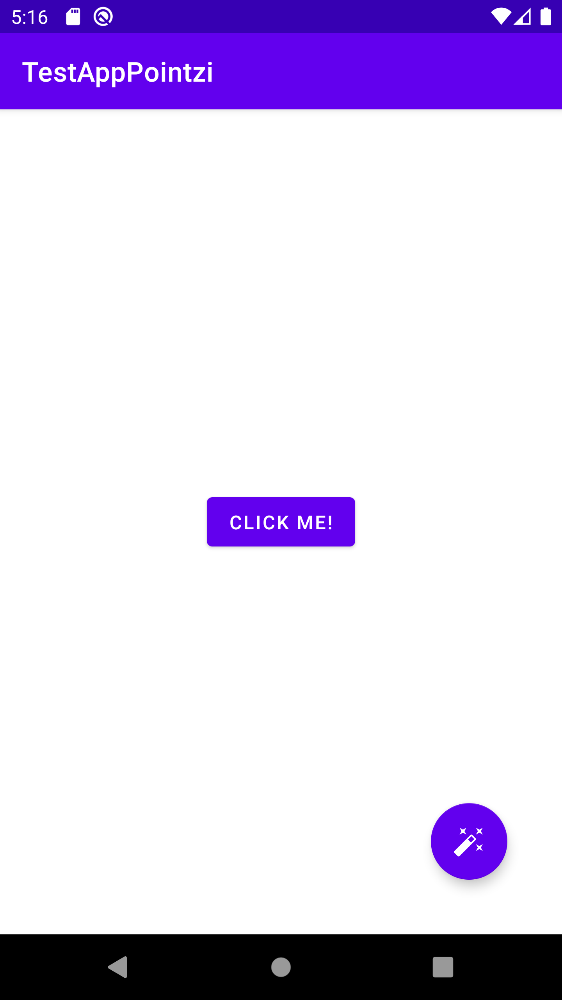
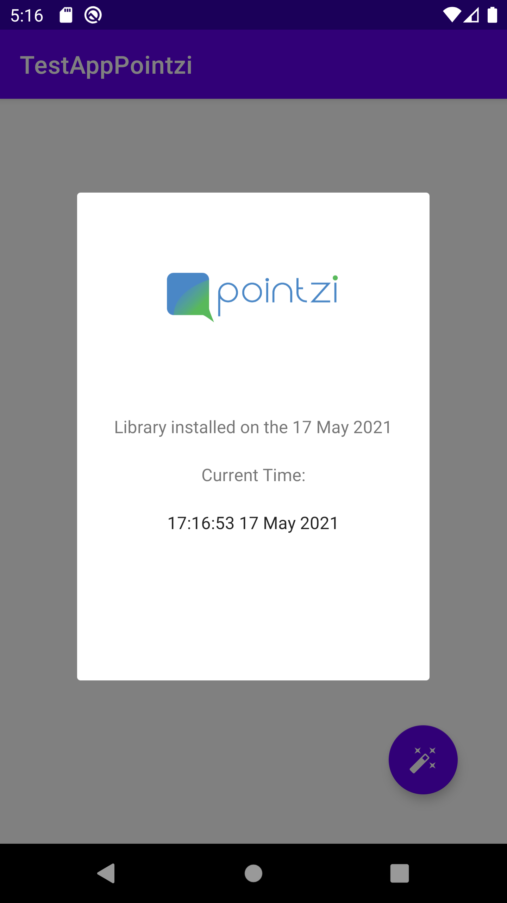
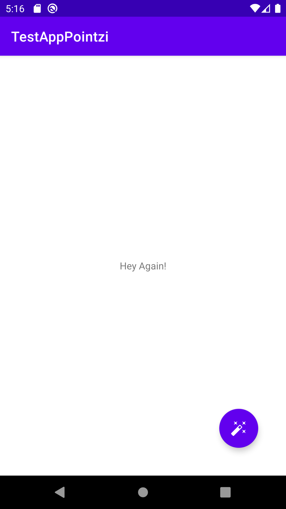
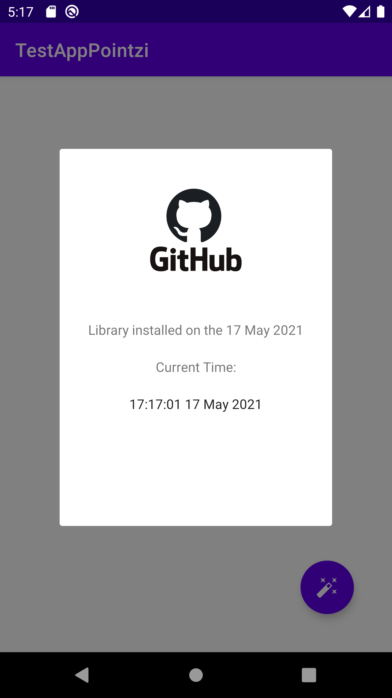

# Android Custom Lib

This is a simple standalone lib, that can be integrated easily on your android application, simple to integrate and easy to use. The lib is with purpose to add a floating action button on your activity main layout, and when click it shows another dialog screen with installation date and current time live. 

## Screenshots
<br><br>
[](screenshots/screenshot1.png)
[](screenshots/screenshot2.png)
[](screenshots/screenshot3.png)
[](screenshots/screenshot4.png)


## Setup
Clone this repository and import into **Android Studio**
```bash
git clone https://github.com/islem19/AndroidCustomLib.git
```

## How to Integrate Lib in your Android App: 

- First, clone the repository on your local machine 
- on your android studio app project, go to File -> New -> Import Module
- select the folder previously cloned of the library and click finish
- in your app/build.gradle file, add the implementation of your lib in dependencies : 

```gradle
dependencies {
    // add the implementation of the project library, use the same name 
    // as the one defined when imported
    implementation project(':library')

}

```

## Usage : 

- first, check the how to integrate lib on the section above. 
- on your main activity class : 

```kotlin
class MainActivity : AppCompatActivity() {
    // get the class instance 
    private val customPointzi by lazy { CustomPointzi(this) }

    override fun onCreate(savedInstanceState: Bundle?) {
        super.onCreate(savedInstanceState)
        setContentView(R.layout.activity_main)

        // call the customPointzi class with the Build() fun to build and show the Fab
        customPointzi.build()
    }
}

```
or you can do it in one line : 

```kotlin
class MainActivity : AppCompatActivity() {
    override fun onCreate(savedInstanceState: Bundle?) {
        super.onCreate(savedInstanceState)
        setContentView(R.layout.activity_main)

        // call the customPointzi class with the Build() fun to build and show the Fab
        CustomPointzi(this).build()
    }
}

```

- you can customize the icon of the model show by the dialog of the lib : 

```kotlin
class MainActivity : AppCompatActivity() {
    override fun onCreate(savedInstanceState: Bundle?) {
        super.onCreate(savedInstanceState)
        setContentView(R.layout.activity_main)

        // customize the icon showen by the model by calling the fun setIcon(url) before you build
        CustomPointzi(this)
                .setIcon("YOUR_IMAGE_URL_HERE")
                .build()
    }
}

```


## Permissions
The Library requires the following permissions:
- Internet access : to be able to communicate through internet 

## Libraries and Dependencies
- [Kotlin](https://kotlinlang.org/)
- [Google Material Compoenent](https://material.io/components) : contains diffent component to help in creating a Material design UI.
- [Glide](https://github.com/bumptech/glide) : is a fast and efficient image loading library for Android
